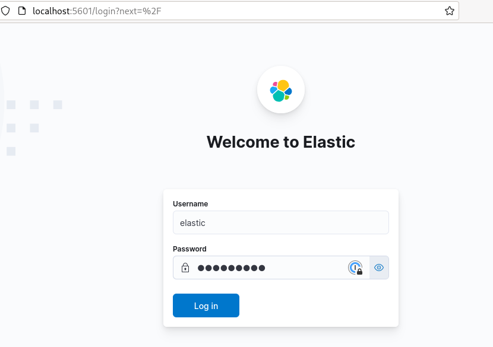
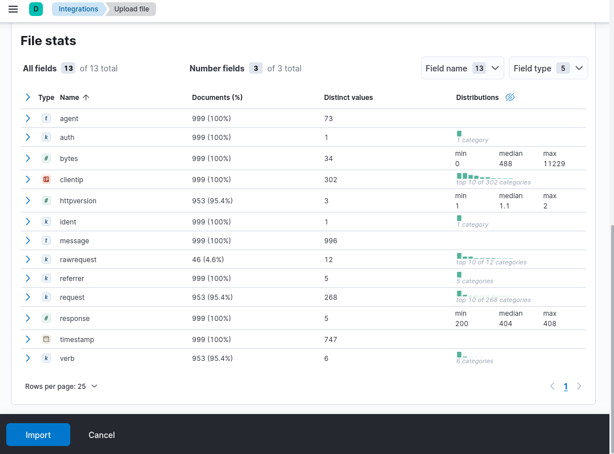
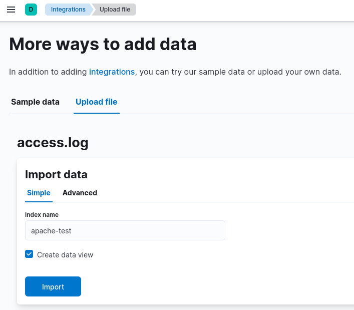
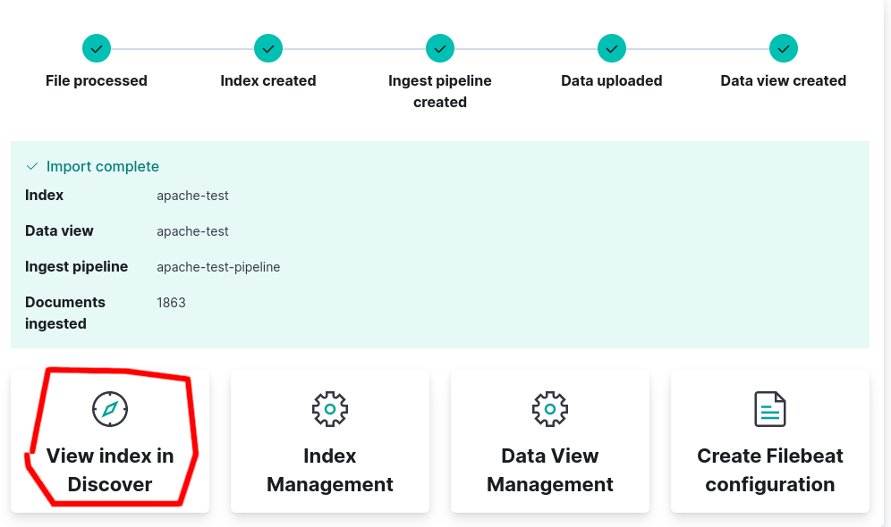
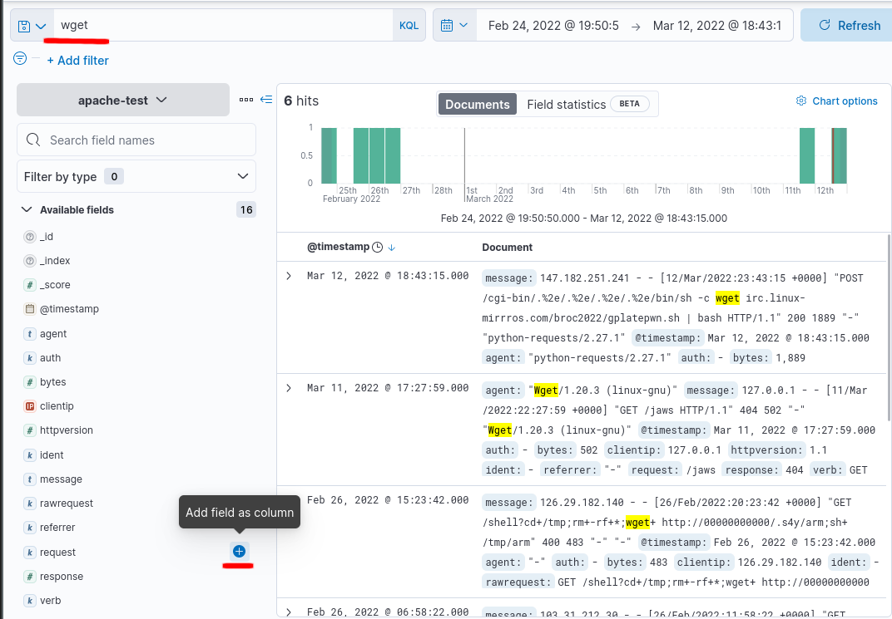

## A Needle in A Haystack

The corresponding Apache log file in this directory has numerous entries, some of which are malicious.
It's all too common to run across log files where you'll have to slice and dice a text file to parse out valuable data.
Sometimes you'll have a nice SIEM to help you query said data, othertimes you'll have to manually parse through logs.
For your first lab, you're tasked to write a script to do the following in the language of your choice:

1. Identify unique count of IPs in this file.
2. Parse out entries that are non-200 status code
3. Perform lookups against a 3rd party API for data enrichment. 
* Is there any historical threat intel?


### Walkthrough Examples
<br />
<details><summary> Bash Example of Unique Count</summary>

```bash
# Get unique IPs
$> cat access.log  | cut -f 1 -d ' ' | uniq -c 
```
</details>


<br />
<details><summary> Bash Example of Querying API </summary>

```bash
# Get unique IPs
uniqueips=$(cat access.log  | cut -f 1 -d ' ' | uniq -c | awk '{print $2}') # create a list of space separated IPs

# query 
for ip in $uniquieips; do
    results=$(curl https://pulsedive.com/api/explore.php?q=$ip) 
    score=$(echo $results | jq '.results|.[].risk')
    countrycode=$(echo $results  | jq '.results|.[].summary.properties.geo.countrycode')
    echo -e "[$(date -Im)] $ip ($countrycode): $score"
    sleep 10;
done
```
</details>


## Hunting in A SIEM
Elasticsearch is an Open Source NoSQL database that is commonly used in industry for log management.
Commerical features support SIEM/Security functionality as well as observability and more.
Kibana is the user interface that queries Elasticsearch for logs. In this scenario we'll setup an Elasticsearch
cluster via docker-compose and upload some log files to begin analyzing the Apache log in a SIEM like environment.


The docker-compose.yml in this directory was taken from the official Elasticsearch documentation and can be [found here](https://www.elastic.co/guide/en/elasticsearch/reference/current/docker.html).

To start the Elasticsearch cluster, execute the following:
``` sh
$> docker-compose up -d
```

The Vagrant file performs port forwarding from the host on 5601 to the guest on port 5601 the default Kibana port.
Check that the containers are successfully up and running via ```docker ps```. If everything is up and running, you should be able to access the cluster.
```
vagrant@bsidesroc:~$ docker ps
CONTAINER ID   IMAGE                                                 COMMAND                  CREATED          STATUS                    PORTS                              NAMES
b02a4f434a7a   docker.elastic.co/kibana/kibana:8.1.0                 "/bin/tini -- /usr/l…"   19 minutes ago   Up 19 minutes (healthy)   0.0.0.0:5601->5601/tcp             01_log_analysis_kibana_1
fb91c3578d62   docker.elastic.co/elasticsearch/elasticsearch:8.1.0   "/bin/tini -- /usr/l…"   22 minutes ago   Up 20 minutes (healthy)   9200/tcp, 9300/tcp                 01_log_analysis_es03_1
01720278b636   docker.elastic.co/elasticsearch/elasticsearch:8.1.0   "/bin/tini -- /usr/l…"   22 minutes ago   Up 20 minutes (healthy)   9200/tcp, 9300/tcp                 01_log_analysis_es02_1
7cc1383a1461   docker.elastic.co/elasticsearch/elasticsearch:8.1.0   "/bin/tini -- /usr/l…"   22 minutes ago   Up 20 minutes (healthy)   0.0.0.0:9200->9200/tcp, 9300/tcp   01_log_analysis_es01_1
```

The images below show the process of logging in and uploading the apache.log file in this directory.









Now that you've imported an apache log, explore  how you would filter out suspicious entries.
